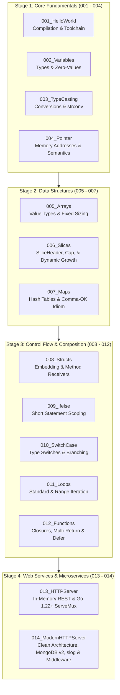

# 🚀 Go-Programming: Zero to Production

[](https://golang.org)
[](https://github.com/golang-standards/project-layout)
[](https://www.mongodb.com/)
[](LICENSE)
[](https://github.com/subhranil002/GO-Programming/pulls)

A modular, hands-on, and enterprise-grade roadmap for mastering **Go (Golang)**. This repository traverses the entire spectrum of Go engineering—progressing from low-level memory mechanics, zero-values, and data structures to idiomatic Go 1.22+ routing, production REST design, and clean enterprise microservices.

---

## 📑 Table of Contents

- [Architectural Overview](#-architectural-overview)
- [Learning Roadmap](#-learning-roadmap)
- [Module Directory Breakdown](#-module-directory-breakdown)
- [Core Concepts & Highlights](#-core-concepts--highlights)
  - [Memory Mechanics: Pointers & Slices](#1-memory-mechanics-pointers--slices)
  - [Composition & Type System](#2-composition--type-system)
  - [Go 1.22+ HTTP Routing](#3-go-122-http-routing)
- [Production Microservice: 014_ModernHTTPServer](#-production-microservice-014_modernhttpserver)
  - [Architecture & Design](#clean-architecture-layering)
  - [Project Layout](#project-layout)
  - [Configuration & Environment](#configuration--environment)
  - [API Specification & Examples](#api-specification--examples)
  - [Build Automation (Makefile)](#build-automation)
- [Getting Started](#-getting-started)
- [Code Conventions & Best Practices](#-code-conventions--best-practices)
- [License & Credits](#-license--credits)

---

## 🏛️ Architectural Overview

The repository is structured to bridge the gap between algorithmic language fundamentals and real-world software engineering:



---

## 🗺️ Learning Roadmap

| Stage | Focus Area | Key Competencies |
| :--- | :--- | :--- |
| **01. Language Basics** | Syntax & Primitives | Go compiler, runtime, declaration syntax (`var`, `:=`), constants, memory zero values. |
| **02. Memory Management** | Pointers & Memory Layout | Pointer arithmetic absence, pass-by-value vs pass-by-reference semantics, heap vs stack allocations. |
| **03. Collections** | Arrays, Slices & Hash Maps | `reflect.SliceHeader` internals, reallocation amortized costs, map lookups, hash collision internals. |
| **04. OOP & Structuring** | Composition over Inheritance | Struct embedding, tagged serialization (`json`, `bson`), value vs pointer receivers. |
| **05. Control & Flow** | Branching & Deferred Calls | Short variable declarations in conditionals, clean switch logic, `defer` LIFO stacks. |
| **06. Web & Distributed Systems** | Enterprise Backend Architecture | Go 1.22 routing, layered architecture, context timeouts, structured `slog` logging, MongoDB driver v2. |

---

## 📂 Module Directory Breakdown

| Directory | Topic | Key Files | Description & Key Patterns |
| :--- | :--- | :--- | :--- |
| `001_HelloWorld` | Environment Setup | `main.go` | Entry point, `main` package, standard library `fmt`, and compilation process. |
| `002_Variables` | Variable System | `main.go` | Strongly-typed variable definitions, implicit type inference, format verbs (`%v`, `%T`). |
| `003_TypeCasting` | Type Casting | `main.go` | Explicit numerical conversions (`int64`, `float64`), string parsing via `strconv` package. |
| `004_Pointer` | Pointers & References | `main.go` | Address-of operator (`&`), dereferencing (`*`), avoiding heavy copy overhead. |
| `005_Arrays` | Fixed Arrays | `main.go` | Fixed-length array memory layouts, multi-dimensional collections, array literal syntax. |
| `006_Slices` | Dynamic Slices | `main.go` | Slices as dynamic views: pointer, length, and capacity (`len`, `cap`), `append()`, sub-slicing. |
| `007_Maps` | Hash Maps | `main.go` | Key-value mapping, key existence checks with comma-ok idiom (`val, ok := map[key]`), `delete()`. |
| `008_Structs` | Structs & Methods | `main.go` | Custom types, anonymous field embedding (composition), method sets on value vs pointer receivers. |
| `009_Ifelse` | Conditional Logic | `main.go` | Idiomatic if-else structures, scoped variable assignments before conditions (`if val, err := ...; err != nil`). |
| `010_SwitchCase` | Switch Branching | `main.go` | Expression-less switches, multi-value cases, `fallthrough` behavior, clean replacement for nested branches. |
| `011_Loops` | Iteration | `main.go` | Go's unified `for` loop: traditional C-style loops, condition-only while-style loops, and `for range`. |
| `012_Functions` | Functions & Defer | `main.go` | Multiple return values, named returns, variadic parameters (`...T`), first-class closures, `defer` keyword. |
| `013_HTTPServer` | Standard REST API | `go.mod`, `main.go` | In-memory CRUD with standard library `net/http`, Go 1.22 route patterns (`METHOD /path/{param}`), JSON streaming. |
| `014_ModernHTTPServer` | Enterprise Microservice | *(Full Layout)* | Layered architecture (Clean/Hexagonal), MongoDB driver v2, structured logging with `slog`, middleware, and graceful shutdowns. |

---

## 🔬 Core Concepts & Highlights

### 1. Memory Mechanics: Pointers & Slices
Go strictly uses **pass-by-value**. Understanding how slice headers and pointers operate in memory is crucial:

```
Slice Header (24 bytes on 64-bit architecture):
+--------------------+--------------------+--------------------+
|  Pointer to Array  |    Length (len)    |  Capacity (cap)    |
|       8 bytes      |       8 bytes      |       8 bytes      |
+--------------------+--------------------+--------------------+
          |
          v
    [ elem0, elem1, elem2, ... elemN ]
```
- Passing a slice creates a copy of the *header*, pointing to the same underlying backing array.
- Calling `append()` beyond `cap` triggers an allocation of a new, doubled array, detaching from the previous backing buffer.

### 2. Composition & Type System
Go intentionally eschews traditional class inheritance in favor of **composition via embedding**:
```go
type Author struct {
    Fullname string `json:"fullname"`
    Website  string `json:"website"`
}

type Course struct {
    CourseId    string  `json:"courseid"`
    CourseName  string  `json:"coursename"`
    CoursePrice int     `json:"courseprice"`
    Author      *Author `json:"author"` // Pointer composition
}
```

### 3. Go 1.22+ HTTP Routing
No third-party router (like Gorilla Mux or Chi) is required for RESTful APIs:
```go
mux := http.NewServeMux()
mux.HandleFunc("GET /courses", getAllCourses)
mux.HandleFunc("POST /courses", createCourse)
mux.HandleFunc("GET /courses/{id}", getCourse)       // Path parameter {id}
mux.HandleFunc("PATCH /courses/{id}", updateCourse)
mux.HandleFunc("DELETE /courses/{id}", deleteCourse)
```

---

## 🏢 Production Microservice: `014_ModernHTTPServer`

The final module demonstrates how enterprise Go web services are engineered according to industry standards.

### Clean Architecture Layering

```
                     ┌────────────────────────────────┐
                     │          HTTP Client           │
                     └────────────────────────────────┘
                                     │
                             (HTTP JSON Request)
                                     ▼
                     ┌────────────────────────────────┐
                     │      Structured Logging        │ (pkg/logger & internal/middleware)
                     │          Middleware            │
                     └────────────────────────────────┘
                                     │
                                     ▼
                     ┌────────────────────────────────┐
                     │          HTTP Handler          │ (internal/employee/handler.go)
                     │ - Parse/Validate Request Body  │
                     │ - Format Standard JSON Response│
                     └────────────────────────────────┘
                                     │
                                     ▼
                     ┌────────────────────────────────┐
                     │        Business Service        │ (internal/employee/service.go)
                     │ - Business Rule Validation     │
                     │ - Domain Orchestration         │
                     └────────────────────────────────┘
                                     │
                                     ▼
                     ┌────────────────────────────────┐
                     │           Repository           │ (internal/employee/repository.go)
                     │ - Database Operations          │
                     │ - BSON Document Mapping        │
                     └────────────────────────────────┘
                                     │
                                     ▼
                     ┌────────────────────────────────┐
                     │      MongoDB Driver v2         │ (go.mongodb.org/mongo-driver/v2)
                     └────────────────────────────────┘
```

### Project Layout

Adheres directly to the official [Standard Go Project Layout](https://github.com/golang-standards/project-layout):

```
014_ModernHTTPServer/
├── cmd/
│   └── server/
│       └── main.go               # Dependency injection, connection lifecycle, graceful shutdown
├── internal/
│   ├── config/
│   │   └── config.go             # Environment variable parsing with strict validation
│   ├── database/
│   │   └── mongodb.go            # MongoDB client initialization and ping verification
│   ├── employee/
│   │   ├── model.go              # Domain entities, DTOs (Create/Update requests)
│   │   ├── repository.go         # Database abstraction layer (CRUD queries)
│   │   ├── service.go            # Domain business logic layer
│   │   └── handler.go           # HTTP controller layer with error handling
│   ├── middleware/
│   │   └── logger.go             # Request duration & path logger middleware
│   └── router/
│       └── router.go             # Route registrations on enhanced http.ServeMux
├── pkg/
│   ├── logger/
│   │   └── logger.go             # Global structured JSON logger based on log/slog
│   └── response/
│       └── response.go           # Standardized JSON response envelope helpers
├── .env.example                  # Template configuration file
├── .gitignore                    # Prevents secret leaks (.env, binaries)
├── Makefile                      # Standardized developer workflows
├── go.mod                        # Go module definition
└── go.sum                        # Checksums for immutable dependencies
```

### Configuration & Environment

Environment variables are loaded and validated fail-fast during startup:

```bash
# Copy example configuration
cp 014_ModernHTTPServer/.env.example 014_ModernHTTPServer/.env
```

| Variable | Type | Default | Description |
| :--- | :--- | :--- | :--- |
| `PORT` | Integer | `3000` | HTTP listening port (validated 1-65535) |
| `APP_ENV` | String | `development` | Runtime environment (`development`, `production`, `test`) |
| `MONGODB_URI` | String | *Required* | MongoDB connection string (SRV or standard URI) |
| `MONGODB_DATABASE` | String | *Required* | Target database name |
| `MONGODB_COLLECTION`| String | *Required* | Target collection name |

### Standardized Response Envelope

Every endpoint consistently returns the same unified payload contract:

**Success Response (`200 OK`, `201 Created`):**
```json
{
  "success": true,
  "message": "Employee created successfully",
  "data": {
    "id": "66d6c9f68e9f2b801a39f1c0",
    "name": "Alex Mercer",
    "email": "alex@company.internal",
    "phone": "+1-555-0199",
    "department": "Platform Engineering",
    "salary": 125000
  }
}
```

**Error Response (`400 Bad Request`, `404 Not Found`, `500 Internal Error`):**
```json
{
  "success": false,
  "message": "invalid employee id format",
  "data": {}
}
```

### API Specification & Examples

#### 1. System Health Check
```bash
curl -X GET http://localhost:3000/health
```

#### 2. Create Employee
```bash
curl -X POST http://localhost:3000/employees \
  -H "Content-Type: application/json" \
  -d '{
    "name": "Jane Doe",
    "email": "jane.doe@example.com",
    "phone": "+1-555-1234",
    "department": "Engineering",
    "salary": 95000.00
  }'
```

#### 3. List All Employees
```bash
curl -X GET http://localhost:3000/employees
```

#### 4. Get Employee by ID
```bash
curl -X GET http://localhost:3000/employees/<EMPLOYEE_ID>
```

#### 5. Partially Update Employee (PATCH)
```bash
curl -X PATCH http://localhost:3000/employees/<EMPLOYEE_ID> \
  -H "Content-Type: application/json" \
  -d '{
    "salary": 105000.00,
    "department": "Senior Engineering"
  }'
```

#### 6. Delete Employee
```bash
curl -X DELETE http://localhost:3000/employees/<EMPLOYEE_ID>
```

### Build Automation

The modern HTTP server provides a standard `Makefile` for streamlined development:

```bash
cd 014_ModernHTTPServer

# Run the server in development mode
make run

# Build release binary into bin/server
make build

# Clean and update dependencies
make tidy

# Clean compiled artifacts
make clean
```

---

## ⚡ Getting Started

### Prerequisites
- **Go**: Version `1.22.0` or higher installed ([Download Go](https://go.dev/dl/))
- **Git**: Installed and configured
- **MongoDB**: Local MongoDB instance or free [MongoDB Atlas Cluster](https://www.mongodb.com/atlas) (for `014_ModernHTTPServer`)

### Clone & Run

```bash
# Clone the repository
git clone https://github.com/subhranil002/GO-Programming.git
cd GO-Programming

# Run any standalone module directly
go run ./001_HelloWorld/main.go
go run ./004_Pointer/main.go
go run ./006_Slices/main.go
go run ./012_Functions/main.go

# Run the in-memory HTTP server
go run ./013_HTTPServer/main.go

# Run the modern production microservice
cd 014_ModernHTTPServer
cp .env.example .env   # Configure your MongoDB URI
make run
```

---

## 🛡️ Code Conventions & Best Practices

This repository strictly complies with idiomatic Go design guidelines:

1. **Error Handling as Values**: Errors are values, not exceptions. Every operation checking errors is explicit without swallowing failures.
2. **Context Cancellation & Timeouts**: All network operations (`http.Server`, MongoDB commands) utilize `context.WithTimeout` to avoid hanging resources.
3. **Structured Logging**: Using standard library `log/slog` for structured JSON logs, suitable for modern log aggregators (Datadog, Loki, CloudWatch).
4. **Leak-Free Concurrency**: Goroutines and HTTP handlers clean up allocated resources via `defer` statements.
5. **Secure Configuration**: Secrets and endpoints are injected dynamically via environment variables without hardcoding.

---

## 📄 License & Credits

Distributed under the **MIT License**. See `LICENSE` for more information.

Developed and maintained by **Subhranil Chakraborty** ([@subhranil002](https://github.com/subhranil002)).
Feel free to star ⭐ this repository if it helps your Go journey!